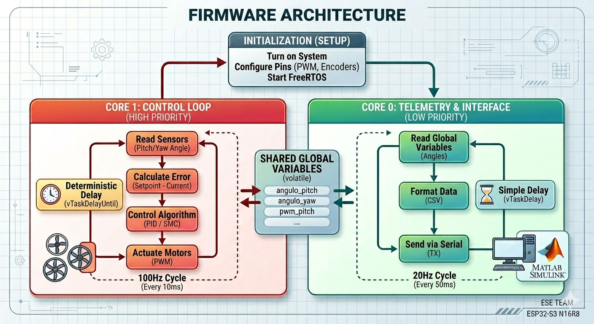
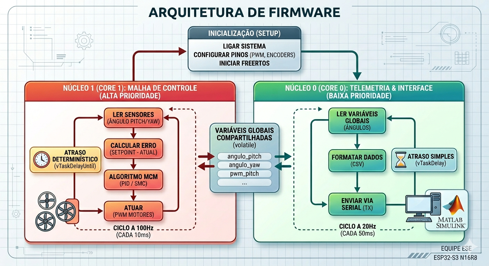

#  Firmware de Controle  🚁

---

## English

Control and telemetry firmware developed by the Electronics and Embedded Systems (ESE) team for the Bench Drone.

### 📌 About the Project
The goal of this project is to provide a deterministic, real-time control loop to stabilize the Quanser Aero 2 (1-DOF and 2-DOF) using an ESP32-S3.

### 🧠 Firmware Architecture (Dual-Core RTOS)
The system uses the native FreeRTOS from ESP-IDF to isolate critical processes:
* **Core 1 (Critical Control):** Sampling frequency fixed at 100Hz (10ms) responsible for reading Encoders/IMU, calculating the control law (PID/SMC), and acting on the motors' PWM.
* **Core 0 (Telemetry):** Responsible for real-time data transmission (CSV via Serial) for external processing in MATLAB/Simulink by the MCM (Modeling) team.

### 🖼️ System Architecture Diagram

### ⚙️ Hardware
* **Microcontroller:** ESP32-S3 DevKitC-1 (16MB Flash, 8MB PSRAM)
* **Sensors:** Quadrature Optical Encoders
* **Actuators:** DC Motors with PWM drivers

### 📝 Roadmap (PC2)
- [x] Hardware Mapping (Pinout)
- [x] Real-Time Environment Setup (FreeRTOS)
- [x] Dual-Core Loop Implementation
- [ ] Integration of Modeling equations (MCM Team)

---

## Português

Firmware de controle e telemetria desenvolvido pela equipe de Eletrônica e Sistemas Embarcados (ESE) para o Drone de Bancada.

### 📌 Sobre o Projeto
O objetivo deste projeto é fornecer uma malha de controle determinística e em tempo real para estabilizar o Quanser Aero 2 (1-DOF e 2-DOF) utilizando um ESP32-S3.

### 🧠 Arquitetura de Firmware (Dual-Core RTOS)
O sistema utiliza o FreeRTOS nativo do ESP-IDF para isolar processos críticos:
* **Core 1 (Controle Crítico):** Frequência de amostragem cravada em 100Hz (10ms) responsável por ler os Encoders/IMU, calcular a lei de controle (PID/SMC) e atuar sobre o PWM dos motores.
* **Core 0 (Telemetria):** Responsável pelo envio em tempo real (CSV via Serial) das variáveis de estado para processamento externo no MATLAB/Simulink pela equipe de Modelagem (MCM).

### 🖼️ Diagrama da Arquitetura

### ⚙️ Hardware Utilizado
* **Microcontrolador:** ESP32-S3 DevKitC-1 (16MB Flash, 8MB PSRAM)
* **Sensores:** Encoders Ópticos em Quadratura
* **Atuadores:** Motores DC com drivers PWM

### 📝 Roadmap (PC2)
- [x] Mapeamento de Hardware (Pinout)
- [x] Configuração do Ambiente de Tempo Real (FreeRTOS)
- [x] Implementação do Loop Dual-Core
- [ ] Integração das equações da equipe de Modelagem