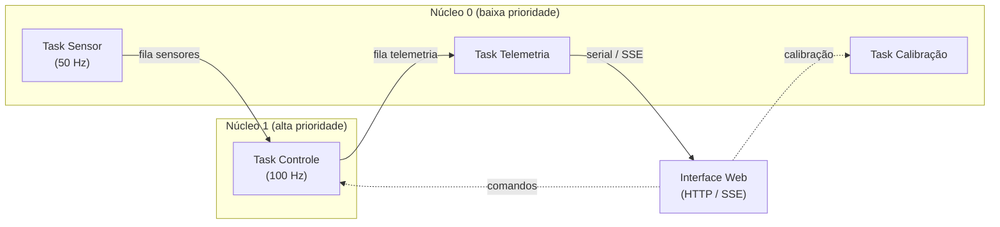

# Firmware de Controle — Drone de Bancada

Firmware de controle e telemetria desenvolvido pela equipe de Eletrônica e Sistemas Embarcados (ESE) para estabilização do drone de bancada em 1-DOF e 2-DOF, utilizando ESP32-S3.

---

## Hardware

| Componente | Modelo / Detalhe |
|---|---|
| Microcontrolador | ESP32-S3 DevKitC-1 (16 MB Flash, 8 MB PSRAM) |
| IMU | MPU6050 (I2C) |
| Encoders | Ópticos em quadratura — 600 PPR × 4 = 2400 pulsos/volta |
| Motores | DC com driver PWM bidirecional (RPWM/LPWM) |

---

## Arquitetura de Firmware

O sistema usa FreeRTOS em dual-core para isolar o controle crítico da telemetria:

## Arquitetura do Firmware



Núcleo 1 executa uma única tarefa de controle em ciclo determinístico de 100 Hz (`vTaskDelayUntil`), responsável por ler os ângulos mais recentes, calcular o erro, executar a lei de controle por realimentação de estados com ação integral e atuar os motores via PWM.

Núcleo 0 executa três tarefas concorrentes: aquisição de sensores (encoders a 50 Hz, `vTaskDelay`), telemetria (serial CSV + SSE) e calibração (sob demanda). A comunicação entre tarefas é feita exclusivamente por filas FreeRTOS.

| Task | Core | Frequência | Responsabilidade |
|---|---|---|---|
| `taskSensor` | 0 | 50 Hz | Lê IMU + encoders e distribui dados via filas |
| `taskTelemetry` | 0 | 50 Hz | Envia CSV via Serial e JSON via SSE para o browser |
| `taskControl` | 1 | 100 Hz | Lê dados da fila, calcula lei de controle e aciona motores |
| `taskCalibration` | 0 | event-driven | Calibração de IMU, motores e encoders sob demanda da web |

A comunicação entre tasks é feita exclusivamente por **filas FreeRTOS** — sem variáveis globais compartilhadas.

```
IMU::read() ──► sensorQueue ──► taskControl   ──► Motor::setVelocidade()
            └──► telemQueue  ──► taskTelemetry ──► Serial (CSV para MATLAB)
                                              └──► SSE /api/events (browser)

web ──► motorCmdQueue   ──► taskControl      (acionamento manual / calibração)
    ──► calibCmdQueue   ──► taskCalibration  (rotinas de calibração)
    ──► ctrlParamsQueue ──► taskControl      (ganhos do controlador em runtime)
```

---

## Modos de Controle

Configuráveis em runtime via interface web, sem reflash.

| Modo | Descrição |
|---|---|
| `OPEN_LOOP` | Duty cycle fixo — útil para identificação do sistema |
| `DOF1` | Controle de pitch: `U = Ki1·∫(rp − θ)dt − [Kx1 Kx2]·[θ, θ̇]ᵀ` com anti-windup |
| `DOF2` | Controle acoplado pitch + yaw com ganhos cruzados (Ki3, Ki4, Kx3–Kx8) e anti-windup independente por canal |

---

## Calibração

O sistema possui rotinas de calibração acessíveis pela interface web, com dados persistidos em LittleFS (`/calibration.json`):

| Rotina | Descrição |
|---|---|
| **IMU** | Coleta 500 amostras em repouso e calcula offsets de bias (acelerômetro + giroscópio) |
| **Motores** | Rampa crescente de duty até encoder detectar movimento — determina deadband por direção |
| **Encoders** | Zera posição atual e salva no flash — corrige drift após mover o drone com energia desligada |
| **Reset** | Remove `/calibration.json` e restaura todos os defaults |

Na inicialização, os offsets e posições salvas são automaticamente aplicados. Um shutdown handler garante que a posição dos encoders seja salva ao desligar de forma controlada.

---

## Interface Web

O ESP32 sobe como **Access Point Wi-Fi**. Conecte-se à rede configurada e acesse `192.168.4.1` no browser.

| Página | Rota | Função |
|---|---|---|
| Config PID | `/` | Ajuste dos ganhos e modo de controle em runtime |
| Teste de Motor | `/test` | Controle manual de duty cycle com telemetria em tempo real |

---

## Como começar

### Pré-requisitos

- [PlatformIO](https://platformio.org/) instalado (extensão VS Code ou CLI)
- ESP32-S3 conectado via USB

### 1. Clonar e configurar credenciais

```bash
git clone <url-do-repo>
cd integrador
cp include/env_example.h include/env.h
```

Edite `include/env.h` com o nome e senha da rede Wi-Fi que o ESP32 irá criar:

```cpp
#define AP_SSID     "NomeDaRede"
#define AP_PASSWORD "SenhaDaRede"
```

### 2. Compilar e gravar

```bash
pio run --target upload      # grava o firmware
pio run --target uploadfs    # grava as páginas web (rodar uma vez ou ao alterar data/)
pio device monitor           # abre o monitor serial (115200 baud)
```

---

## Roadmap

- [x] Mapeamento de hardware e pinout
- [x] Ambiente FreeRTOS dual-core
- [x] Leitura de IMU (MPU6050) e encoders em quadratura
- [x] Telemetria Serial (CSV) para MATLAB/Simulink
- [x] Interface web com configuração de ganhos e teste de motor
- [x] Lei de controle — DOF1 e DOF2 com state-space e anti-windup
- [x] Sistema de calibração (IMU, motores, encoders) com persistência em LittleFS
